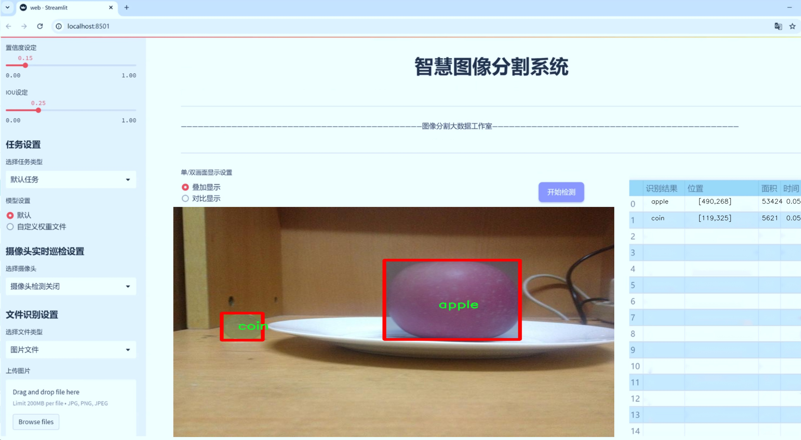
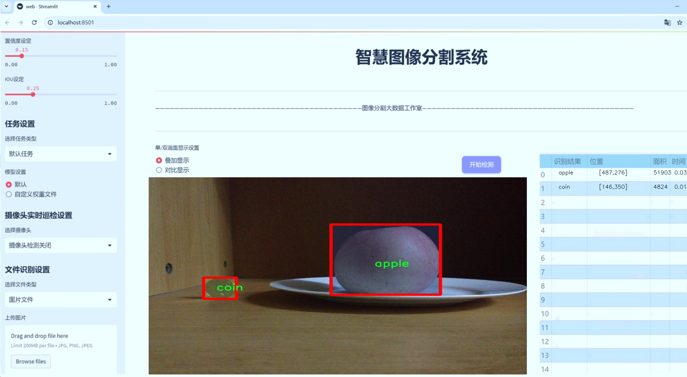
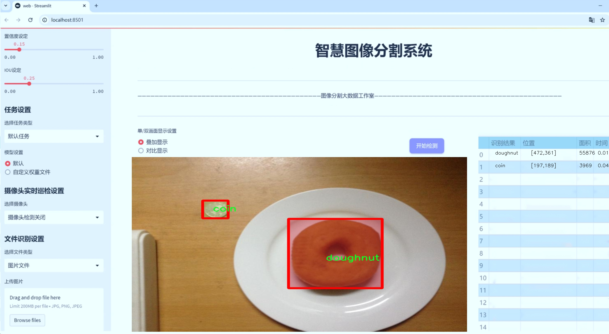
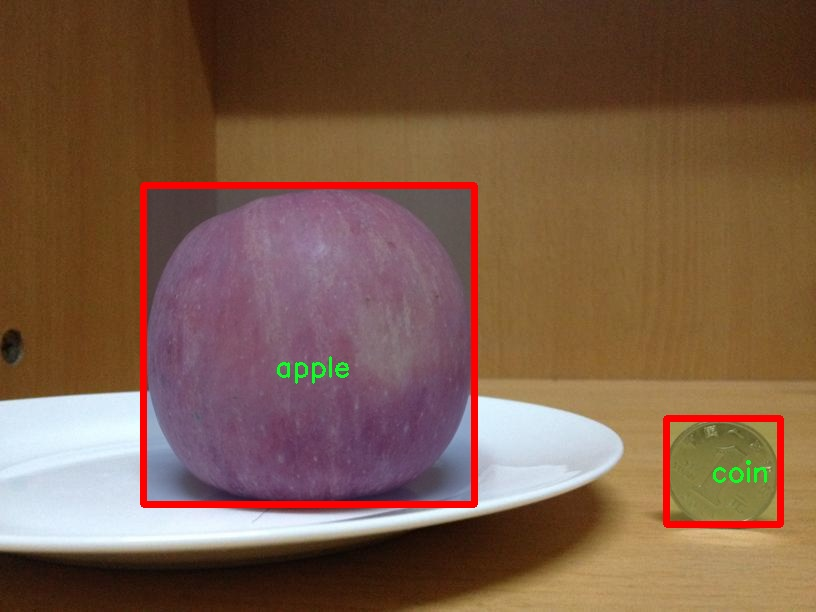
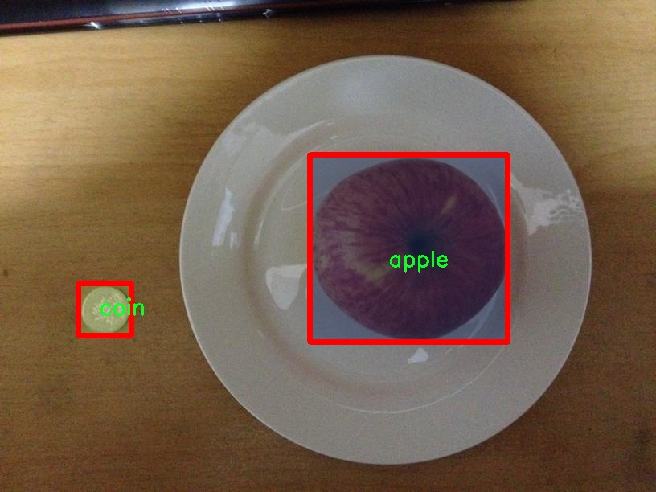
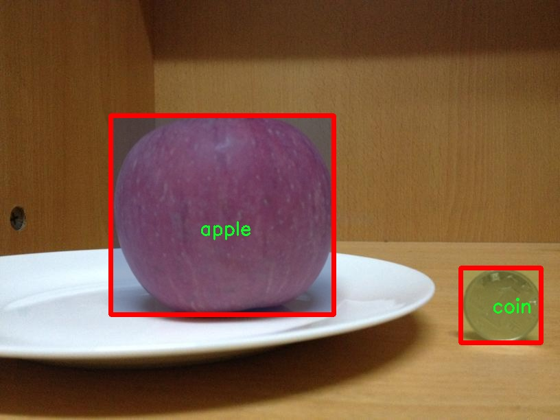
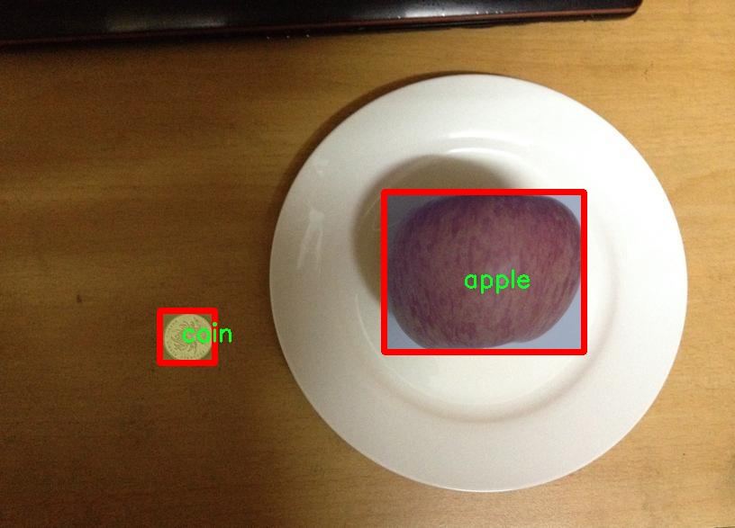
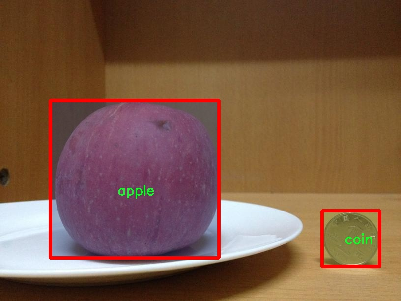

# 食品与硬币实例分割系统源码＆数据集分享
 [yolov8-seg-AFPN-P345＆yolov8-seg-C2f-RFCAConv等50+全套改进创新点发刊_一键训练教程_Web前端展示]

### 1.研究背景与意义

项目参考[ILSVRC ImageNet Large Scale Visual Recognition Challenge](https://gitee.com/YOLOv8_YOLOv11_Segmentation_Studio/projects)

项目来源[AAAI Global Al lnnovation Contest](https://kdocs.cn/l/cszuIiCKVNis)

研究背景与意义

随着计算机视觉技术的快速发展，实例分割作为一种重要的图像处理任务，越来越受到学术界和工业界的广泛关注。实例分割不仅要求对图像中的物体进行分类，还需要精确地识别出每个物体的边界，提供更为细致的视觉信息。在食品和硬币的实例分割领域，准确的物体识别和分割不仅有助于自动化生产线的监控与管理，还能在食品安全、质量检测及金融领域中发挥重要作用。因此，开发一个高效且准确的实例分割系统显得尤为重要。

本研究基于改进的YOLOv8模型，旨在构建一个专门针对食品与硬币的实例分割系统。YOLO（You Only Look Once）系列模型因其高效的实时检测能力而广受欢迎，而YOLOv8在此基础上进行了多项改进，进一步提升了模型的精度和速度。通过对YOLOv8的改进，我们希望能够在复杂背景下实现对食品和硬币的高效分割，满足实际应用中的需求。

在本研究中，我们使用的数据集包含3000张图像，涵盖20个类别，包括苹果、香蕉、面包、包子、硬币、甜甜圈、鸡蛋、炸面圈、葡萄、柠檬、荔枝、芒果、月饼、橙子、桃子、梨子、李子、猕猴桃、沙琪玛和西红柿。这些类别不仅具有丰富的多样性，还在实际应用中具有广泛的代表性。通过对这些食品和硬币的实例分割，我们可以为食品工业和金融行业提供更为智能化的解决方案。

食品安全是现代社会面临的重要问题之一，如何快速、准确地识别和分类食品，是保障食品安全的重要环节。通过实例分割技术，我们可以实现对食品的自动化检测，及时发现不合格产品，从而提高食品生产的安全性和效率。同时，在金融领域，硬币的识别与分类也是一项重要的任务，尤其是在自动售货机和银行自助设备中，准确的硬币识别能够提高交易的效率，减少人为错误。

此外，基于改进YOLOv8的实例分割系统还可以为学术研究提供丰富的数据支持。通过对不同类别食品和硬币的分割结果进行分析，我们可以深入探讨不同物体的特征及其在图像中的表现，为后续的研究提供理论基础。同时，该系统的开发也为相关领域的研究者提供了一个新的研究平台，促进了计算机视觉技术在实际应用中的推广与应用。

综上所述，本研究不仅在技术上具有重要意义，也在实际应用中展现出广阔的前景。通过构建基于改进YOLOv8的食品与硬币实例分割系统，我们期望能够推动实例分割技术的发展，提升相关行业的智能化水平，为社会的可持续发展贡献一份力量。

### 2.图片演示







##### 注意：由于此博客编辑较早，上面“2.图片演示”和“3.视频演示”展示的系统图片或者视频可能为老版本，新版本在老版本的基础上升级如下：（实际效果以升级的新版本为准）

  （1）适配了YOLOV8的“目标检测”模型和“实例分割”模型，通过加载相应的权重（.pt）文件即可自适应加载模型。

  （2）支持“图片识别”、“视频识别”、“摄像头实时识别”三种识别模式。

  （3）支持“图片识别”、“视频识别”、“摄像头实时识别”三种识别结果保存导出，解决手动导出（容易卡顿出现爆内存）存在的问题，识别完自动保存结果并导出到tempDir中。

  （4）支持Web前端系统中的标题、背景图等自定义修改，后面提供修改教程。

  另外本项目提供训练的数据集和训练教程,暂不提供权重文件（best.pt）,需要您按照教程进行训练后实现图片演示和Web前端界面演示的效果。

### 3.视频演示

[3.1 视频演示](https://www.bilibili.com/video/BV1b927YXEaU/)

### 4.数据集信息展示

##### 4.1 本项目数据集详细数据（类别数＆类别名）

nc: 20
names: ['apple', 'banana', 'bread', 'bun', 'coin', 'doughnut', 'egg', 'fired_dough_twist', 'grape', 'lemon', 'litchi', 'mango', 'mooncake', 'orange', 'peach', 'pear', 'plum', 'qiwi', 'sachima', 'tomato']


##### 4.2 本项目数据集信息介绍

数据集信息展示

在本研究中，我们使用了名为“food-coin-instance”的数据集，旨在改进YOLOv8-seg模型在食品与硬币实例分割任务中的表现。该数据集包含20个不同的类别，涵盖了多种常见的食品和硬币对象，具体类别包括：苹果、香蕉、面包、包子、硬币、甜甜圈、鸡蛋、炸面团、葡萄、柠檬、荔枝、芒果、月饼、橙子、桃子、梨子、李子、猕猴桃、沙琪玛和西红柿。这些类别的选择不仅反映了日常生活中常见的食品种类，还包括了多样化的硬币，旨在提高模型对不同物体的识别和分割能力。

数据集的构建过程经过精心设计，以确保其在实例分割任务中的有效性和准确性。每个类别的样本数量均衡，确保模型在训练过程中能够接触到足够的多样性，从而提高其泛化能力。此外，数据集中每个类别的图像均经过标注，包含了物体的边界框和分割掩码，这对于YOLOv8-seg模型的训练至关重要。通过这些标注，模型能够学习到每个物体的形状和特征，从而在实际应用中实现精准的实例分割。

“food-coin-instance”数据集不仅在类别选择上体现了多样性，还在图像质量和复杂性上进行了严格把控。数据集中包含的图像来自不同的场景和光照条件，涵盖了各种拍摄角度和背景。这种多样性使得模型在面对真实世界中的复杂情况时，能够更好地适应和应对。例如，食品的颜色、形状和纹理各异，而硬币则具有不同的材质和反光特性，这些都为模型的训练提供了丰富的学习素材。

在训练过程中，我们采用了数据增强技术，以进一步提升模型的鲁棒性。通过旋转、缩放、裁剪和颜色变换等手段，增加了数据集的有效样本数量，帮助模型在不同情况下保持良好的识别能力。这种增强不仅提高了模型对常见物体的识别率，也使其在处理未见过的物体时，能够展现出更强的适应性。

总之，“food-coin-instance”数据集为改进YOLOv8-seg的食品与硬币实例分割系统提供了坚实的基础。通过精心设计的类别选择、严格的标注过程以及有效的数据增强策略，该数据集不仅提升了模型的训练效果，也为未来的研究提供了丰富的参考。我们相信，基于这一数据集训练出的模型将能够在实际应用中展现出卓越的性能，为食品和硬币的自动识别与分割任务提供有效的解决方案。











### 5.全套项目环境部署视频教程（零基础手把手教学）

[5.1 环境部署教程链接（零基础手把手教学）](https://www.bilibili.com/video/BV1jG4Ve4E9t/?vd_source=bc9aec86d164b67a7004b996143742dc)


[5.2 安装Python虚拟环境创建和依赖库安装视频教程链接（零基础手把手教学）](https://www.bilibili.com/video/BV1nA4VeYEze/?vd_source=bc9aec86d164b67a7004b996143742dc)

### 6.手把手YOLOV8-seg训练视频教程（零基础小白有手就能学会）

[6.1 手把手YOLOV8-seg训练视频教程（零基础小白有手就能学会）](https://www.bilibili.com/video/BV1cA4VeYETe/?vd_source=bc9aec86d164b67a7004b996143742dc)


按照上面的训练视频教程链接加载项目提供的数据集，运行train.py即可开始训练



     Epoch   gpu_mem       box       obj       cls    labels  img_size
     1/200     0G   0.01576   0.01955  0.007536        22      1280: 100%|██████████| 849/849 [14:42<00:00,  1.04s/it]
               Class     Images     Labels          P          R     mAP@.5 mAP@.5:.95: 100%|██████████| 213/213 [01:14<00:00,  2.87it/s]
                 all       3395      17314      0.994      0.957      0.0957      0.0843

     Epoch   gpu_mem       box       obj       cls    labels  img_size
     2/200     0G   0.01578   0.01923  0.007006        22      1280: 100%|██████████| 849/849 [14:44<00:00,  1.04s/it]
               Class     Images     Labels          P          R     mAP@.5 mAP@.5:.95: 100%|██████████| 213/213 [01:12<00:00,  2.95it/s]
                 all       3395      17314      0.996      0.956      0.0957      0.0845

     Epoch   gpu_mem       box       obj       cls    labels  img_size
     3/200     0G   0.01561    0.0191  0.006895        27      1280: 100%|██████████| 849/849 [10:56<00:00,  1.29it/s]
               Class     Images     Labels          P          R     mAP@.5 mAP@.5:.95: 100%|███████   | 187/213 [00:52<00:00,  4.04it/s]
                 all       3395      17314      0.996      0.957      0.0957      0.0845


### 7.50+种全套YOLOV8-seg创新点代码加载调参视频教程（一键加载写好的改进模型的配置文件）

[7.1 50+种全套YOLOV8-seg创新点代码加载调参视频教程（一键加载写好的改进模型的配置文件）](https://www.bilibili.com/video/BV1Hw4VePEXv/?vd_source=bc9aec86d164b67a7004b996143742dc)

### 8.YOLOV8-seg图像分割算法原理

原始YOLOv8-seg算法原理

YOLOv8-seg算法是Ultralytics公司在2023年推出的YOLO系列算法中的一个重要版本，旨在提升目标检测和图像分割的性能。作为YOLOv8的扩展，YOLOv8-seg不仅继承了YOLOv8在速度和精度上的优势，还引入了更为复杂的分割功能，使其在处理图像中的细粒度信息时表现得更加出色。该算法的核心在于其独特的网络结构设计，主要由输入层、Backbone、Neck和Head四个部分组成，形成了一个高效的特征提取和处理流程。

在输入层，YOLOv8-seg采用了640x640的标准输入尺寸，但在实际应用中，算法能够自适应地调整输入图像的长宽比，以减少信息冗余并提高检测速度。具体而言，YOLOv8-seg在推理阶段通过缩放长边并填充短边的方式来保持图像的完整性。这种方法不仅有效地减少了填充区域的影响，还使得模型在不同尺寸和比例的图像上都能保持较高的检测性能。此外，YOLOv8-seg在训练过程中引入了Mosaic增强技术，通过将四张不同的图像随机拼接，生成新的训练样本，从而使模型能够学习到更多的上下文信息和空间关系，提高了模型的泛化能力和准确性。

Backbone部分是YOLOv8-seg的特征提取核心。与YOLOv5不同，YOLOv8-seg采用了C2F模块替代了C3模块，这一设计灵感来源于YOLOv7中的ELAN模块。C2F模块通过并行化多个梯度流分支，能够更有效地提取图像中的特征信息，尤其是在处理复杂场景时，其轻量化的特性确保了高效的计算性能。通过这种结构，YOLOv8-seg不仅保留了良好的特征提取能力，还能在保持较低计算负担的同时，提升模型的精度。

在Neck部分，YOLOv8-seg结合了特征金字塔网络和路径聚合网络的优势，形成了一个双塔结构。这一设计使得不同尺度的特征能够更好地融合，从而增强了模型对各种目标的检测能力。特征金字塔网络通过多层次的特征提取，能够有效地捕捉到不同尺度目标的语义信息，而路径聚合网络则进一步促进了特征的流动和融合，使得网络在处理复杂场景时表现得更加灵活和高效。

Head部分是YOLOv8-seg中最为重要的模块之一，其结构从传统的Coupled-Head转变为Decoupled-Head。这样的设计使得检测和分类的过程得以解耦，分别通过不同的卷积模块进行处理。这种分离不仅加速了模型的收敛速度，还提高了检测的准确性。在损失函数的设计上，YOLOv8-seg摒弃了传统的Obj分支，采用了BCELoss和DFL+CIoULoss的组合，以便更好地聚焦于目标的边界和位置，提高了模型在目标检测和分割任务中的表现。

值得注意的是，YOLOv8-seg在目标检测的方式上进行了重大创新，采用了Anchor-Free的方法。这一方法的核心在于将目标检测转化为关键点检测，而不再依赖于预设的锚框。这种转变使得YOLOv8-seg在处理不同形状和大小的目标时更加灵活，且避免了传统Anchor-Based方法中计算复杂度高和灵活性不足的问题。通过这种方式，YOLOv8-seg能够在多种场景下保持高效的检测性能，尤其是在目标形态多样化的情况下，表现得尤为突出。

总的来说，YOLOv8-seg算法在YOLOv8的基础上进行了深度优化，通过改进的网络结构和创新的检测方法，显著提升了目标检测和图像分割的能力。其在多尺度特征融合、解耦检测和Anchor-Free检测等方面的创新，使得YOLOv8-seg在实际应用中展现出强大的性能，能够广泛应用于智能监控、自动驾驶、人脸识别等领域，为相关研究和应用提供了有力的支持。通过不断的技术迭代和优化，YOLOv8-seg无疑将成为目标检测和图像分割领域的重要工具，推动相关技术的发展与应用。


### 9.系统功能展示（检测对象为举例，实际内容以本项目数据集为准）

图9.1.系统支持检测结果表格显示

  图9.2.系统支持置信度和IOU阈值手动调节

  图9.3.系统支持自定义加载权重文件best.pt(需要你通过步骤5中训练获得)

  图9.4.系统支持摄像头实时识别

  图9.5.系统支持图片识别

  图9.6.系统支持视频识别

  图9.7.系统支持识别结果文件自动保存

  图9.8.系统支持Excel导出检测结果数据


### 10.50+种全套YOLOV8-seg创新点原理讲解（非科班也可以轻松写刊发刊，V11版本正在科研待更新）

#### 10.1 由于篇幅限制，每个创新点的具体原理讲解就不一一展开，具体见下列网址中的创新点对应子项目的技术原理博客网址【Blog】：


[10.1 50+种全套YOLOV8-seg创新点原理讲解链接](https://gitee.com/qunmasj/good)

#### 10.2 部分改进模块原理讲解(完整的改进原理见上图和技术博客链接)【此小节的图要是加载失败请移步原始博客查看，链接：https://blog.csdn.net/cheng2333333?type=blog】
### 可变性卷积DCN简介
卷积神经网络由于其构建模块中固定的几何结构，本质上受限于模型几何变换。为了提高卷积神经网络的转换建模能力，《Deformable Convolutional Networks》作者提出了两个模块：可变形卷积（deformable convolution）和可变形RoI池（deformable RoI pooling）。这两个模块均基于用额外的偏移来增加模块中的空间采样位置以及从目标任务中学习偏移的思想，而不需要额外的监督。

第一次证明了在深度神经网络中学习密集空间变换（dense spatial transformation）对于复杂的视觉任务是有效的

视觉识别中的一个关键挑战是如何适应对象比例、姿态、视点和零件变形中的几何变化或模型几何变换。一般有两种方法实现：
1）建立具有足够期望变化的训练数据集。这通常通过增加现有的数据样本来实现，例如通过仿射变换。但是训练成本昂贵而且模型参数庞大。
2）使用变换不变（transformation-invariant）的特征和算法。比如比较有名的SIFT(尺度不变特征变换)便是这一类的代表算法。

但以上的方法有两个缺点：
1）几何变换被假定为固定的和已知的，这些先验知识被用来扩充数据，设计特征和算法。为此，这个假设阻止了对具有未知几何变换的新任务的推广，从而导致这些几何变换可能没有被正确建模。
2）对于不变特征和算法进行手动设计，对于过于复杂的变换可能是困难的或不可行的。

卷积神经网络本质上局限于模拟大型未知转换。局限性源于CNN模块的固定几何结构：卷积单元在固定位置对输入特征图进行采样；池化层以固定比率降低特征矩阵分辨率；RoI（感兴趣区域）池化层将RoI分成固定的空间箱（spatial bins）等。缺乏处理几何变换的内部机制。

这种内部机制的缺乏会导致一些问题，举个例子。同一个CNN层中所有激活单元的感受野大小是相同的，但是这是不可取的。因为不同的位置可能对应于具有不同尺度或变形的对象，所以尺度或感受野大小的自适应确定对于具有精细定位的视觉识别是渴望的。

对于这些问题，作者提出了两个模块提高CNNs对几何变换建模的能力。


deformable convolution（可变形卷积）
将2D偏移量添加到标准卷积中的常规网格采样位置，使得采样网格能够自由变形。通过额外的卷积层，从前面的特征映射中学习偏移。因此，变形采用局部、密集和自适应的方式取决于输入特征。


deformable RoI pooling（可变形RoI池化）
为先前RoI池化的常规库（bin）分区中的每个库位置（bin partition）增加了一个偏移量。类似地，偏移是从前面的特征图和感兴趣区域中学习的，从而能够对具有不同形状的对象进行自适应部件定位（adaptive part localization）。

#### Deformable Convolutional Networks
Deformable Convolution
2D卷积由两个步骤组成：
1）在输入特征图x xx上使用规则网格R RR进行采样。
2）把这些采样点乘不同权重w ww后相加。

网格R定义感受野大小和扩张程度，比如内核大小为3x3，扩张程度为1的网格R可以表示为：
R = { ( − 1 , − 1 ) , ( − 1 , 0 ) , … , ( 0 , 1 ) , ( 1 , 1 ) } R = \{(-1,-1),(-1,0),\dots,(0,1),(1,1)\}
R={(−1,−1),(−1,0),…,(0,1),(1,1)}

​
 一般为小数，使用双线性插值进行处理。（把小数坐标分解到相邻的四个整数坐标点来计算结果）


具体操作如图所示：


首先对输入特征层进行一个普通的3x3卷积处理得到偏移域（offset field）。偏移域特征图具有与输入特征图相同的空间分辨率，channels维度2N对应于N个2D（xy两个方向）偏移。其中的N是原输入特征图上所具有的N个channels，也就是输入输出channels保持不变，这里xy两个channels分别对输出特征图上的一个channels进行偏移。确定采样点后就通过与相对应的权重w点乘相加得到输出特征图上该点最终值。

前面也提到过，由于这里xy两个方向所训练出来的偏移量一般来说是一个小数，那么为了得到这个点所对应的数值，会采用双线性插值的方法，从最近的四个邻近坐标点中计算得到该偏移点的数值，公式如下：


具体推理过程见：双线性插值原理

#### Deformable RoI Poolingb
所有基于区域提议（RPN）的对象检测方法都使用RoI池话处理，将任意大小的输入矩形区域转换为固定大小的特征图。


 一般为小数，需要使用双线性插值进行处理。


具体操作如图所示：


当时看这个部分的时候觉得有些突兀，明明RoI池化会将特征层转化为固定尺寸的区域。其实，我个人觉得，这个部分与上述的可变性卷积操作是类似的。这里同样是使用了一个普通的RoI池化操作，进行一些列处理后得到了一个偏移域特征图，然后重新作用于原来的w × H w \times Hw×H的RoI。只不过这里不再是规律的逐行逐列对每个格子进行池化，而是对于格子进行偏移后再池化处理。

#### Postion﹣Sensitive RoI Pooling
除此之外，论文还提出一种PS RoI池化（Postion﹣Sensitive RoI Pooling）。不同于上述可变形RoI池化中的全连接过程，这里使用全卷积替换。

具体操作如图所示：


首先，对于原来的特征图来说，原本是将输入特征图上的RoI区域分成k × k k\times kk×k个bin。而在这里，则是将输入特征图进行卷积操作，分别得到一个channels为k 2 ( C + 1 ) k^{2}(C+1)k (C+1)的得分图（score maps）和一个channels为2 k 2 ( C + 1 ) 2k{2}(C+1)2k 2 (C+1)的偏移域（offset fields），这两个特征矩阵的宽高是与输入特征矩阵相同的。其中，得分图的channels中，k × k k \times kk×k分别表示的是每一个网格，C CC表示的检测对象的类别数目，1表示背景。而在偏移域中的2表示xy两个方向的偏移。
也就是说，在PS RoI池化中，对于RoI的每一个网格都独自占一个通道形成一层得分图，然后其对于的偏移量占两个通道。offset fields得到的偏移是归一化后的偏移，需要通过和deformable RoI pooling中一样的变换方式得到∆ p i j ∆p_{ij}∆p ij，然后对每层得分图进行偏移池化处理。最后处理完的结果就对应着最后输出的一个网格。所以其包含了位置信息。

原文论述为：


#### Understanding Deformable ConvNets
当可变形卷积叠加时，复合变形的效果是深远的。如图所示：


ps：a是标准卷积的固定感受野，b是可变形卷积的适应性感受野。

感受野和标准卷积中的采样位置在整个顶部特征图上是固定的(左)。在可变形卷积中，它们根据对象的比例和形状进行自适应调整(右)。


### 11.项目核心源码讲解（再也不用担心看不懂代码逻辑）

#### 11.1 ultralytics\data\augment.py

以下是经过精简和注释的核心代码部分，主要集中在图像增强和变换的实现上。注释详细解释了每个类和方法的功能。

```python
import random
import numpy as np
import cv2

class BaseTransform:
    """
    图像变换的基类，提供基本的图像处理方法。
    """

    def __init__(self) -> None:
        """初始化BaseTransform对象。"""
        pass

    def apply_image(self, labels):
        """应用图像变换到标签。"""
        pass

    def apply_instances(self, labels):
        """应用变换到标签中的物体实例。"""
        pass

    def apply_semantic(self, labels):
        """应用语义分割变换到图像。"""
        pass

    def __call__(self, labels):
        """应用所有标签变换到图像、实例和语义掩码。"""
        self.apply_image(labels)
        self.apply_instances(labels)
        self.apply_semantic(labels)


class Compose:
    """
    组合多个图像变换的类。
    """

    def __init__(self, transforms):
        """初始化Compose对象，接受变换列表。"""
        self.transforms = transforms

    def __call__(self, data):
        """对输入数据应用一系列变换。"""
        for t in self.transforms:
            data = t(data)
        return data


class RandomFlip:
    """
    随机水平或垂直翻转图像，并相应更新实例（边界框、关键点等）。
    """

    def __init__(self, p=0.5, direction='horizontal') -> None:
        """初始化RandomFlip类，设置翻转概率和方向。"""
        assert direction in ['horizontal', 'vertical'], f'支持方向为`horizontal`或`vertical`，但得到了{direction}'
        assert 0 <= p <= 1.0
        self.p = p
        self.direction = direction

    def __call__(self, labels):
        """对图像应用随机翻转，并更新实例。"""
        img = labels['img']
        if self.direction == 'vertical' and random.random() < self.p:
            img = np.flipud(img)  # 垂直翻转
        if self.direction == 'horizontal' and random.random() < self.p:
            img = np.fliplr(img)  # 水平翻转
        labels['img'] = img
        return labels


class RandomPerspective:
    """
    实现随机透视和仿射变换，包括旋转、平移、缩放和剪切。
    """

    def __init__(self, degrees=0.0, translate=0.1, scale=0.5, shear=0.0, perspective=0.0):
        """初始化RandomPerspective对象，设置变换参数。"""
        self.degrees = degrees
        self.translate = translate
        self.scale = scale
        self.shear = shear
        self.perspective = perspective

    def __call__(self, labels):
        """对图像和目标应用随机透视变换。"""
        img = labels['img']
        # 透视变换逻辑...
        return labels


class LetterBox:
    """
    通过添加边框调整图像大小，以适应检测、实例分割和姿态估计。
    """

    def __init__(self, new_shape=(640, 640)):
        """初始化LetterBox对象，设置目标形状。"""
        self.new_shape = new_shape

    def __call__(self, labels=None, image=None):
        """返回更新后的标签和图像，添加边框。"""
        img = labels['img'] if image is None else image
        # 计算缩放比例和填充...
        return labels


class Format:
    """
    格式化图像注释，以便用于PyTorch DataLoader的collate_fn。
    """

    def __init__(self, bbox_format='xywh', normalize=True):
        """初始化Format类，设置边界框格式和归一化选项。"""
        self.bbox_format = bbox_format
        self.normalize = normalize

    def __call__(self, labels):
        """返回格式化的图像、类、边界框和关键点。"""
        img = labels.pop('img')
        instances = labels.pop('instances')
        # 处理实例和边界框...
        return labels


def v8_transforms(dataset, imgsz, hyp):
    """将图像转换为适合YOLOv8训练的大小。"""
    pre_transform = Compose([
        RandomPerspective(degrees=hyp.degrees, translate=hyp.translate, scale=hyp.scale),
        RandomFlip(direction='horizontal', p=hyp.flipud),
        LetterBox(new_shape=(imgsz, imgsz))
    ])
    return Compose([pre_transform])
```

### 代码核心部分解释
1. **BaseTransform**: 基类，定义了图像变换的基本接口。
2. **Compose**: 组合多个变换，按顺序应用。
3. **RandomFlip**: 随机翻转图像，支持水平和垂直翻转。
4. **RandomPerspective**: 随机透视变换，包含旋转、平移、缩放等。
5. **LetterBox**: 调整图像大小并添加边框，适应目标检测模型输入。
6. **Format**: 格式化图像和注释，以便于PyTorch的DataLoader使用。
7. **v8_transforms**: 组合不同的变换以适应YOLOv8的训练需求。

以上是对代码的核心部分进行了提炼和注释，方便理解和使用。

这个文件是一个用于图像增强的模块，主要用于计算机视觉任务，特别是目标检测和图像分类。它包含多个类和方法，用于实现不同的图像增强技术。以下是对文件中主要内容的详细说明。

首先，文件引入了一些必要的库，包括数学库、随机数生成库、OpenCV、NumPy、PyTorch和TorchVision等。这些库为图像处理和深度学习提供了基础功能。

接下来，定义了一个基类`BaseTransform`，它为各种图像转换提供了基础框架。这个类包含了初始化方法和一些应用图像、实例和语义分割的方法。具体的转换逻辑会在其子类中实现。

`Compose`类用于将多个图像转换组合在一起。它接受一个转换列表，并在调用时依次应用这些转换。这个类还提供了添加新转换和将转换列表转换为标准Python列表的方法。

`BaseMixTransform`类是一个基类，用于实现混合增强（如MixUp和Mosaic）。它包含了对数据集的引用、预处理转换和应用混合增强的概率。具体的混合逻辑在其子类中实现。

`Mosaic`类实现了马赛克增强，通过将多个图像（通常是4个或9个）组合成一个马赛克图像。它提供了获取随机索引、应用混合转换和更新标签的方法。

`MixUp`类实现了MixUp增强，它通过将两张图像混合来生成新的图像，增强模型的泛化能力。

`RandomPerspective`类实现了随机透视变换和仿射变换。它允许对图像进行旋转、平移、缩放和剪切等操作，并可以根据指定的概率条件应用这些变换。

`RandomHSV`类负责对图像的色调、饱和度和亮度进行随机调整，以增加数据的多样性。

`RandomFlip`类实现了随机翻转图像的功能，可以选择水平或垂直翻转，并根据给定的概率更新实例（如边界框和关键点）。

`LetterBox`类用于调整图像大小并添加填充，以适应目标检测和实例分割任务。它可以保持图像的长宽比，并在需要时进行中心对齐。

`CopyPaste`类实现了复制粘贴增强，能够将图像中的实例复制到另一张图像上，从而生成新的训练样本。

`Albumentations`类提供了一系列基于Albumentations库的图像增强技术，包括模糊、对比度调整、随机亮度和图像压缩等。

`Format`类用于格式化图像注释，以便在PyTorch的DataLoader中使用。它可以标准化图像和实例注释，并返回适合模型输入的格式。

最后，文件中还定义了一些用于分类任务的增强方法，包括`classify_transforms`和`classify_albumentations`，这些方法提供了图像的预处理和增强功能。

总体而言，这个文件提供了丰富的图像增强功能，可以在训练深度学习模型时使用，以提高模型的鲁棒性和泛化能力。

#### 11.2 ultralytics\engine\validator.py

以下是代码中最核心的部分，并附上详细的中文注释：

```python
class BaseValidator:
    """
    BaseValidator类用于创建验证器的基类。

    属性:
        args (SimpleNamespace): 验证器的配置。
        dataloader (DataLoader): 用于验证的数据加载器。
        model (nn.Module): 需要验证的模型。
        device (torch.device): 用于验证的设备。
        speed (dict): 包含预处理、推理、损失和后处理的速度信息。
        save_dir (Path): 保存结果的目录。
    """

    def __init__(self, dataloader=None, save_dir=None, args=None):
        """
        初始化BaseValidator实例。

        参数:
            dataloader (torch.utils.data.DataLoader): 用于验证的数据加载器。
            save_dir (Path, optional): 保存结果的目录。
            args (SimpleNamespace): 验证器的配置。
        """
        self.args = get_cfg(overrides=args)  # 获取配置
        self.dataloader = dataloader  # 数据加载器
        self.model = None  # 模型初始化为None
        self.device = None  # 设备初始化为None
        self.speed = {'preprocess': 0.0, 'inference': 0.0, 'loss': 0.0, 'postprocess': 0.0}  # 速度字典
        self.save_dir = save_dir or get_save_dir(self.args)  # 保存目录

    @smart_inference_mode()
    def __call__(self, trainer=None, model=None):
        """支持验证预训练模型或正在训练的模型。"""
        self.device = select_device(self.args.device)  # 选择设备
        model = AutoBackend(model or self.args.model, device=self.device)  # 初始化模型
        model.eval()  # 设置模型为评估模式

        # 遍历数据加载器中的每个批次
        for batch_i, batch in enumerate(self.dataloader):
            # 预处理
            batch = self.preprocess(batch)

            # 推理
            preds = model(batch['img'])  # 进行推理

            # 更新指标
            self.update_metrics(preds, batch)

        stats = self.get_stats()  # 获取统计信息
        self.print_results()  # 打印结果
        return stats  # 返回统计信息

    def preprocess(self, batch):
        """对输入批次进行预处理。"""
        return batch  # 返回处理后的批次

    def update_metrics(self, preds, batch):
        """根据预测结果和批次更新指标。"""
        pass  # 具体实现由子类定义

    def get_stats(self):
        """返回模型性能的统计信息。"""
        return {}  # 返回空字典，具体实现由子类定义

    def print_results(self):
        """打印模型预测的结果。"""
        pass  # 具体实现由子类定义
```

### 代码核心部分解释：
1. **BaseValidator类**：这是一个基类，用于创建模型验证器。它包含了模型验证所需的基本功能和属性。

2. **初始化方法`__init__`**：在初始化时，配置参数、数据加载器、模型、设备和速度信息等被设置。

3. **调用方法`__call__`**：这是一个重载的方法，使得`BaseValidator`实例可以像函数一样被调用。它负责选择设备、初始化模型并进行推理和结果更新。

4. **预处理方法`preprocess`**：该方法用于对输入批次进行预处理，具体的预处理步骤可以在子类中实现。

5. **更新指标方法`update_metrics`**：该方法用于根据模型的预测结果和输入批次更新性能指标，具体实现留给子类。

6. **获取统计信息方法`get_stats`**：该方法返回模型性能的统计信息，具体实现由子类定义。

7. **打印结果方法`print_results`**：该方法用于打印模型的预测结果，具体实现由子类定义。

这些核心部分构成了模型验证的基础框架，其他功能可以通过继承和扩展该类来实现。

这个程序文件 `ultralytics/engine/validator.py` 是用于验证 YOLO 模型在测试或验证数据集上的准确性。它的主要功能是通过对模型进行推理，计算模型在给定数据集上的性能指标，并生成相应的统计结果。

文件开头包含了使用说明，说明了如何通过命令行调用验证功能，并列出了支持的模型格式，包括 PyTorch、TorchScript、ONNX、OpenVINO、TensorRT 等多种格式。

在代码的主体部分，首先导入了一些必要的库和模块，包括 JSON 处理、时间处理、路径操作、NumPy 和 PyTorch 等。接着，定义了一个 `BaseValidator` 类，这是一个用于创建验证器的基类。该类包含了多个属性，用于存储验证过程中的各种信息，比如配置参数、数据加载器、模型、设备、统计信息等。

`__init__` 方法是构造函数，负责初始化验证器的实例。它接收数据加载器、保存目录、进度条、配置参数和回调函数等参数，并进行相应的设置。这里还包括对输入图像大小的检查和默认置信度的设置。

`__call__` 方法是该类的核心，支持对预训练模型或正在训练的模型进行验证。它首先根据是否有训练器对象来判断当前是否处于训练模式，并相应地设置设备和数据。然后，它会加载模型并进行预热，以确保模型在推理时的性能。

在验证过程中，程序会通过一个进度条显示进度，并对每个批次的数据进行预处理、推理、损失计算和后处理。每个步骤的时间会被记录下来，以便后续的性能分析。验证完成后，程序会计算并打印出统计结果，并在需要时将结果保存为 JSON 格式。

此外，`BaseValidator` 类还定义了一些辅助方法，比如匹配预测结果与真实标签、添加和运行回调函数、获取数据加载器、预处理和后处理数据、初始化和更新性能指标等。这些方法为验证过程提供了必要的支持和功能。

总的来说，这个文件实现了 YOLO 模型验证的基本框架，提供了灵活的接口和功能，以便用户能够方便地评估模型的性能。

#### 11.3 ui.py

以下是代码中最核心的部分，并附上详细的中文注释：

```python
import sys
import subprocess

def run_script(script_path):
    """
    使用当前 Python 环境运行指定的脚本。

    Args:
        script_path (str): 要运行的脚本路径

    Returns:
        None
    """
    # 获取当前 Python 解释器的路径
    python_path = sys.executable

    # 构建运行命令，使用 streamlit 运行指定的脚本
    command = f'"{python_path}" -m streamlit run "{script_path}"'

    # 执行命令，并等待其完成
    result = subprocess.run(command, shell=True)
    
    # 检查命令执行的返回码，如果不为0则表示出错
    if result.returncode != 0:
        print("脚本运行出错。")


# 实例化并运行应用
if __name__ == "__main__":
    # 指定要运行的脚本路径
    script_path = "web.py"  # 这里可以直接指定脚本名，假设在当前目录下

    # 调用函数运行脚本
    run_script(script_path)
```

### 代码注释说明：
1. **导入模块**：
   - `sys`：用于访问与 Python 解释器紧密相关的变量和函数。
   - `subprocess`：用于创建新进程、连接到它们的输入/输出/错误管道，并获得它们的返回码。

2. **定义 `run_script` 函数**：
   - 该函数接受一个参数 `script_path`，表示要运行的 Python 脚本的路径。
   - 使用 `sys.executable` 获取当前 Python 解释器的路径，以确保使用相同的环境来运行脚本。
   - 构建一个命令字符串，使用 `streamlit` 模块运行指定的脚本。
   - 使用 `subprocess.run` 执行命令，并等待其完成。`shell=True` 允许在 shell 中执行命令。
   - 检查命令的返回码，如果返回码不为0，表示脚本运行出错，打印错误信息。

3. **主程序入口**：
   - 使用 `if __name__ == "__main__":` 确保只有在直接运行该脚本时才会执行以下代码。
   - 指定要运行的脚本路径（在这里假设为 `web.py`）。
   - 调用 `run_script` 函数来执行指定的脚本。

这个程序文件的主要功能是使用当前的 Python 环境来运行一个指定的脚本，具体来说是一个名为 `web.py` 的脚本。程序首先导入了必要的模块，包括 `sys`、`os` 和 `subprocess`，这些模块分别用于获取系统信息、处理文件路径和执行外部命令。

在 `run_script` 函数中，首先获取当前 Python 解释器的路径，存储在 `python_path` 变量中。接着，构建一个命令字符串，使用 `streamlit` 来运行指定的脚本。`streamlit` 是一个用于快速构建数据应用的库，这里通过命令行的方式调用它。

随后，使用 `subprocess.run` 方法执行构建好的命令。这个方法会在一个新的 shell 中运行命令，并等待其完成。如果脚本运行过程中出现错误，返回的 `returncode` 将不为零，程序会打印出“脚本运行出错”的提示信息。

在文件的最后部分，使用 `if __name__ == "__main__":` 语句来确保当该文件作为主程序运行时才会执行后面的代码。这里指定了要运行的脚本路径为 `web.py`，并调用 `run_script` 函数来执行该脚本。

总的来说，这个程序的功能是封装了一个简单的命令行工具，用于在当前 Python 环境中运行一个特定的 Streamlit 脚本，方便用户快速启动应用。

#### 11.4 train.py

以下是经过简化和注释的核心代码部分：

```python
import os
import torch
import yaml
from ultralytics import YOLO  # 导入YOLO模型库

if __name__ == '__main__':  # 确保该模块被直接运行时才执行以下代码
    # 设置训练参数
    workers = 1  # 数据加载的工作进程数
    batch = 8  # 每个批次的样本数量
    device = "0" if torch.cuda.is_available() else "cpu"  # 检查是否有可用的GPU

    # 获取数据集配置文件的绝对路径
    data_path = abs_path(f'datasets/data/data.yaml', path_type='current')

    # 将路径格式转换为Unix风格
    unix_style_path = data_path.replace(os.sep, '/')
    # 获取目录路径
    directory_path = os.path.dirname(unix_style_path)

    # 读取YAML文件，保持原有顺序
    with open(data_path, 'r') as file:
        data = yaml.load(file, Loader=yaml.FullLoader)

    # 修改数据集路径
    if 'train' in data and 'val' in data and 'test' in data:
        data['train'] = directory_path + '/train'  # 设置训练集路径
        data['val'] = directory_path + '/val'      # 设置验证集路径
        data['test'] = directory_path + '/test'    # 设置测试集路径

        # 将修改后的数据写回YAML文件
        with open(data_path, 'w') as file:
            yaml.safe_dump(data, file, sort_keys=False)

    # 加载YOLO模型配置和预训练权重
    model = YOLO(r"C:\codeseg\codenew\50+种YOLOv8算法改进源码大全和调试加载训练教程（非必要）\改进YOLOv8模型配置文件\yolov8-seg-C2f-Faster.yaml").load("./weights/yolov8s-seg.pt")

    # 开始训练模型
    results = model.train(
        data=data_path,  # 指定训练数据的配置文件路径
        device=device,    # 使用的设备（GPU或CPU）
        workers=workers,  # 数据加载的工作进程数
        imgsz=640,        # 输入图像的大小
        epochs=100,      # 训练的轮数
        batch=batch,      # 每个批次的样本数量
    )
```

### 代码注释说明：
1. **导入库**：导入必要的库，包括操作系统库、PyTorch、YAML解析库和YOLO模型库。
2. **主程序入口**：使用`if __name__ == '__main__':`确保代码只在直接运行时执行。
3. **设置训练参数**：定义数据加载的工作进程数、批次大小和设备（GPU或CPU）。
4. **获取数据集配置文件路径**：使用`abs_path`函数获取数据集的YAML配置文件的绝对路径。
5. **读取和修改YAML文件**：读取YAML文件，修改训练、验证和测试集的路径，并将修改后的内容写回文件。
6. **加载YOLO模型**：加载YOLO模型的配置文件和预训练权重。
7. **训练模型**：调用`model.train`方法开始训练，传入数据路径、设备、工作进程数、图像大小、训练轮数和批次大小等参数。

该程序文件 `train.py` 是一个用于训练 YOLO（You Only Look Once）模型的脚本。首先，它导入了必要的库，包括 `os`、`torch`、`yaml` 和 `matplotlib`，其中 `YOLO` 是从 `ultralytics` 库中导入的，用于处理 YOLO 模型的相关操作。

在 `__main__` 代码块中，程序首先设置了一些训练参数。`workers` 设置为 1，表示使用一个工作进程来加载数据；`batch` 设置为 8，表示每个批次处理 8 张图像；`device` 则根据是否有可用的 GPU 来选择使用 GPU（"0"）还是 CPU（"cpu"）。

接下来，程序通过 `abs_path` 函数获取数据集配置文件 `data.yaml` 的绝对路径，并将路径格式转换为 Unix 风格，以便后续处理。然后，程序读取该 YAML 文件的内容，并将其解析为 Python 字典。接着，程序检查 YAML 文件中是否包含 `train`、`val` 和 `test` 三个键，如果存在，则更新这些键的值为对应的训练、验证和测试数据集的路径，并将修改后的内容写回到 YAML 文件中。

在模型加载部分，程序使用 `YOLO` 类加载一个指定的模型配置文件（`yolov8-seg-C2f-Faster.yaml`）和预训练权重（`yolov8s-seg.pt`）。此时，用户需要注意，不同的模型对设备的要求不同，如果出现错误，可以尝试使用其他模型配置文件。

最后，程序调用 `model.train()` 方法开始训练模型，传入训练数据的配置文件路径、设备、工作进程数量、输入图像大小（640x640）、训练的 epoch 数量（100）以及批次大小（8）等参数。通过这些设置，程序将开始进行模型的训练过程。

#### 11.5 log.py

以下是代码中最核心的部分，并附上详细的中文注释：

```python
import os
import time
import cv2
import pandas as pd
from PIL import Image

def save_chinese_image(file_path, image_array):
    """
    保存带有中文路径的图片文件

    参数：
    file_path (str): 图片的保存路径，应包含中文字符, 例如 '示例路径/含有中文的文件名.png'
    image_array (numpy.ndarray): 要保存的 OpenCV 图像（即 numpy 数组）
    """
    try:
        # 将 OpenCV 图片转换为 Pillow Image 对象
        image = Image.fromarray(cv2.cvtColor(image_array, cv2.COLOR_BGR2RGB))

        # 使用 Pillow 保存图片文件
        image.save(file_path)

        print(f"成功保存图像到: {file_path}")
    except Exception as e:
        print(f"保存图像失败: {str(e)}")

class LogTable:
    def __init__(self, csv_file_path=None):
        """
        初始化类实例。

        参数：
        csv_file_path (str): 保存初始数据的CSV文件路径。
        """
        self.csv_file_path = csv_file_path
        self.data = pd.DataFrame(columns=['文件路径', '识别结果', '位置', '面积', '时间'])

        # 尝试从CSV文件加载数据，如果失败则创建一个空的DataFrame
        if csv_file_path and os.path.exists(csv_file_path):
            self.data = pd.read_csv(csv_file_path, encoding='utf-8')

    def add_log_entry(self, file_path, recognition_result, position, confidence, time_spent):
        """
        向日志中添加一条新记录。

        参数：
        file_path (str): 文件路径
        recognition_result (str): 识别结果
        position (str): 位置
        confidence (float): 置信度
        time_spent (float): 用时（通常是秒或毫秒）

        返回：
        None
        """
        # 创建新的数据行
        new_entry = pd.DataFrame([[file_path, recognition_result, position, confidence, time_spent]],
                                 columns=['文件路径', '识别结果', '位置', '面积', '时间'])

        # 将新行添加到DataFrame中
        self.data = pd.concat([new_entry, self.data]).reset_index(drop=True)

    def save_to_csv(self):
        """
        将更新后的DataFrame保存到CSV文件
        """
        self.data.to_csv(self.csv_file_path, index=False, encoding='utf-8', mode='a', header=False)

    def update_table(self, log_table_placeholder):
        """
        更新表格，显示最新的500条记录。

        参数：
        log_table_placeholder: Streamlit的表格占位符

        返回：
        None
        """
        # 判断DataFrame的长度是否超过500
        if len(self.data) > 500:
            # 如果超过500，仅显示最新的500条记录
            display_data = self.data.head(500)
        else:
            # 如果不超过，显示全部数据
            display_data = self.data

        log_table_placeholder.table(display_data)
```

### 代码核心部分说明：
1. **save_chinese_image**: 该函数用于保存带有中文路径的图片文件。它将OpenCV格式的图像转换为Pillow格式，并使用Pillow保存图像。

2. **LogTable类**: 该类用于管理日志数据，包括初始化、添加日志条目、保存到CSV文件以及更新显示表格等功能。
   - `__init__`: 初始化类实例，尝试从CSV文件加载数据。
   - `add_log_entry`: 向日志中添加新记录。
   - `save_to_csv`: 将更新后的数据保存到CSV文件。
   - `update_table`: 更新表格以显示最新的记录。

这些核心部分构成了整个代码的基础，主要用于图像保存和日志管理。

这个程序文件 `log.py` 是一个用于处理图像和记录检测结果的工具，主要涉及图像的保存、结果的记录和数据的管理。程序使用了多个库，包括 OpenCV、Pandas、Pillow 和 NumPy，来实现图像处理和数据操作的功能。

首先，程序定义了一个 `save_chinese_image` 函数，该函数用于保存带有中文路径的图像文件。它接收两个参数：文件路径和图像数组。函数内部使用 OpenCV 将图像转换为 Pillow 的 Image 对象，然后通过 Pillow 的 `save` 方法将图像保存到指定路径。如果保存过程中出现错误，会捕获异常并输出错误信息。

接下来，程序定义了一个 `ResultLogger` 类，用于记录检测结果。该类在初始化时创建一个空的 DataFrame，包含“识别结果”、“位置”、“面积”和“时间”四个列。`concat_results` 方法用于将新的检测结果添加到 DataFrame 中，接收检测结果、位置、置信度和时间作为参数，并将这些信息以新行的形式添加到结果 DataFrame 中。

然后，程序定义了一个 `LogTable` 类，负责管理图像和检测结果的记录。该类在初始化时尝试从指定的 CSV 文件加载数据，如果文件不存在，则创建一个空的 DataFrame。类中包含多个方法，例如 `add_frames` 用于添加图像和检测信息，`clear_frames` 用于清空已保存的图像和结果，`save_frames_file` 用于将保存的图像保存为视频或单张图像，`add_log_entry` 用于向日志中添加新记录，`clear_data` 用于清空数据，`save_to_csv` 用于将数据保存到 CSV 文件，以及 `update_table` 用于更新表格以显示最新的记录。

`save_frames_file` 方法根据保存的图像数量决定是保存为单张图像还是视频。如果只有一张图像，则保存为 PNG 格式；如果有多张图像，则将它们合并为一个 AVI 格式的视频。该方法还处理了文件路径的生成和图像的写入。

最后，`add_log_entry` 方法用于将新的记录添加到日志中，并在 `save_to_csv` 方法中将更新后的 DataFrame 保存到 CSV 文件。`update_table` 方法则用于更新显示的表格内容，确保最多只显示最新的 500 条记录。

总体而言，这个程序提供了一整套用于图像处理和结果记录的功能，适合需要处理和记录检测结果的应用场景。

#### 11.6 ultralytics\__init__.py

以下是代码中最核心的部分，并附上详细的中文注释：

```python
# Ultralytics YOLO 🚀, AGPL-3.0 license

# 定义当前版本号
__version__ = '8.0.202'

# 从 ultralytics.models 模块导入所需的模型类
from ultralytics.models import RTDETR, SAM, YOLO
from ultralytics.models.fastsam import FastSAM
from ultralytics.models.nas import NAS

# 从 ultralytics.utils 模块导入设置、检查和下载工具
from ultralytics.utils import SETTINGS as settings
from ultralytics.utils.checks import check_yolo as checks
from ultralytics.utils.downloads import download

# 定义模块的公共接口，方便外部调用
__all__ = '__version__', 'YOLO', 'NAS', 'SAM', 'FastSAM', 'RTDETR', 'checks', 'download', 'settings'
```

### 注释说明：
1. **版本号定义**：`__version__` 变量用于标识当前模块的版本，便于版本管理和更新。
2. **模型导入**：通过 `from ... import ...` 语句导入不同的模型类（如 YOLO、RTDETR、SAM 等），这些模型是进行目标检测和图像处理的核心组件。
3. **工具导入**：导入一些实用工具，如设置（`SETTINGS`）、检查函数（`check_yolo`）和下载函数（`download`），这些工具在模型使用和管理中起到辅助作用。
4. **公共接口定义**：`__all__` 变量定义了模块的公共接口，列出了可以被外部访问的对象，确保模块的封装性和可用性。

这个程序文件是Ultralytics库的初始化文件，文件名为`__init__.py`，用于定义包的版本和导入相关模块。首先，文件中定义了一个版本号`__version__`，其值为'8.0.202'，这表明该库的当前版本。

接下来，文件从`ultralytics.models`模块中导入了多个模型，包括`RTDETR`、`SAM`和`YOLO`，这些模型可能是用于目标检测或图像分割等计算机视觉任务的。除此之外，还从`ultralytics.models.fastsam`导入了`FastSAM`，从`ultralytics.models.nas`导入了`NAS`，这些可能是一些特定的模型或算法，用于提高性能或效率。

文件还导入了一些实用工具和设置，包括`SETTINGS`（设置）和`check_yolo`（用于检查YOLO模型的函数），以及`download`（用于下载相关资源的函数）。这些工具和函数可能在使用模型时提供了必要的支持。

最后，文件通过`__all__`变量定义了该模块的公共接口，列出了可以被外部访问的名称，包括版本号、各个模型、检查函数、下载函数和设置。这种做法有助于明确哪些内容是模块的公共部分，从而避免命名冲突和增强代码的可读性。整体来看，这个文件为Ultralytics库的使用提供了基础的结构和功能模块的导入。

### 12.系统整体结构（节选）

### 整体功能和构架概括

该项目是一个用于目标检测和图像处理的深度学习框架，主要基于YOLO（You Only Look Once）模型及其变种。项目的结构模块化，包含多个功能文件，分别负责数据增强、模型训练、验证、日志记录、模型推理等功能。整体上，项目旨在提供一个高效、易用的工具集，以便用户能够快速构建、训练和评估计算机视觉模型。

以下是各个文件的功能概述：

| 文件路径                                       | 功能描述                                                                                     |
|----------------------------------------------|--------------------------------------------------------------------------------------------|
| `ultralytics\data\augment.py`               | 实现图像增强功能，包括多种数据增强技术，如随机翻转、透视变换、混合增强等，用于提高模型的泛化能力。  |
| `ultralytics\engine\validator.py`           | 负责验证模型性能，计算准确性指标，并生成统计结果，支持不同格式的模型验证。                       |
| `ui.py`                                      | 提供一个命令行工具，用于在当前Python环境中运行指定的Streamlit脚本，方便用户快速启动应用。          |
| `train.py`                                   | 负责训练YOLO模型，设置训练参数，加载数据集和模型配置，并开始训练过程。                          |
| `log.py`                                     | 处理图像保存和检测结果记录，提供日志记录和结果管理功能，包括保存图像、生成视频和记录检测结果。    |
| `ultralytics\__init__.py`                   | 定义包的版本和公共接口，导入模型和工具函数，作为Ultralytics库的初始化文件。                      |
| `ultralytics\models\yolo\detect\val.py`     | 实现YOLO模型的验证功能，处理验证数据集并计算性能指标。                                         |
| `ultralytics\utils\metrics.py`              | 提供用于计算模型性能指标的工具函数，如精确度、召回率和F1分数等。                                 |
| `ultralytics\solutions\ai_gym.py`           | 提供与AI Gym相关的功能，可能用于训练和评估智能体在模拟环境中的表现。                              |
| `ultralytics\engine\predictor.py`           | 实现模型推理功能，负责对输入图像进行推理并返回检测结果。                                        |
| `model.py`                                   | 可能包含模型的定义和结构，具体实现取决于项目的设计。                                            |
| `ultralytics\utils\callbacks\mlflow.py`     | 提供与MLflow集成的回调函数，用于记录和管理模型训练过程中的指标和参数。                           |
| `ultralytics\models\rtdetr\__init__.py`     | 初始化RTDETR模型模块，可能包含相关模型的定义和导入。                                           |

这个表格总结了项目中各个文件的主要功能，帮助用户快速理解项目的结构和各个模块的作用。

注意：由于此博客编辑较早，上面“11.项目核心源码讲解（再也不用担心看不懂代码逻辑）”中部分代码可能会优化升级，仅供参考学习，完整“训练源码”、“Web前端界面”和“50+种创新点源码”以“14.完整训练+Web前端界面+50+种创新点源码、数据集获取”的内容为准。

### 13.图片、视频、摄像头图像分割Demo(去除WebUI)代码

在这个博客小节中，我们将讨论如何在不使用WebUI的情况下，实现图像分割模型的使用。本项目代码已经优化整合，方便用户将分割功能嵌入自己的项目中。
核心功能包括图片、视频、摄像头图像的分割，ROI区域的轮廓提取、类别分类、周长计算、面积计算、圆度计算以及颜色提取等。
这些功能提供了良好的二次开发基础。

### 核心代码解读

以下是主要代码片段，我们会为每一块代码进行详细的批注解释：

```python
import random
import cv2
import numpy as np
from PIL import ImageFont, ImageDraw, Image
from hashlib import md5
from model import Web_Detector
from chinese_name_list import Label_list

# 根据名称生成颜色
def generate_color_based_on_name(name):
    ......

# 计算多边形面积
def calculate_polygon_area(points):
    return cv2.contourArea(points.astype(np.float32))

...
# 绘制中文标签
def draw_with_chinese(image, text, position, font_size=20, color=(255, 0, 0)):
    image_pil = Image.fromarray(cv2.cvtColor(image, cv2.COLOR_BGR2RGB))
    draw = ImageDraw.Draw(image_pil)
    font = ImageFont.truetype("simsun.ttc", font_size, encoding="unic")
    draw.text(position, text, font=font, fill=color)
    return cv2.cvtColor(np.array(image_pil), cv2.COLOR_RGB2BGR)

# 动态调整参数
def adjust_parameter(image_size, base_size=1000):
    max_size = max(image_size)
    return max_size / base_size

# 绘制检测结果
def draw_detections(image, info, alpha=0.2):
    name, bbox, conf, cls_id, mask = info['class_name'], info['bbox'], info['score'], info['class_id'], info['mask']
    adjust_param = adjust_parameter(image.shape[:2])
    spacing = int(20 * adjust_param)

    if mask is None:
        x1, y1, x2, y2 = bbox
        aim_frame_area = (x2 - x1) * (y2 - y1)
        cv2.rectangle(image, (x1, y1), (x2, y2), color=(0, 0, 255), thickness=int(3 * adjust_param))
        image = draw_with_chinese(image, name, (x1, y1 - int(30 * adjust_param)), font_size=int(35 * adjust_param))
        y_offset = int(50 * adjust_param)  # 类别名称上方绘制，其下方留出空间
    else:
        mask_points = np.concatenate(mask)
        aim_frame_area = calculate_polygon_area(mask_points)
        mask_color = generate_color_based_on_name(name)
        try:
            overlay = image.copy()
            cv2.fillPoly(overlay, [mask_points.astype(np.int32)], mask_color)
            image = cv2.addWeighted(overlay, 0.3, image, 0.7, 0)
            cv2.drawContours(image, [mask_points.astype(np.int32)], -1, (0, 0, 255), thickness=int(8 * adjust_param))

            # 计算面积、周长、圆度
            area = cv2.contourArea(mask_points.astype(np.int32))
            perimeter = cv2.arcLength(mask_points.astype(np.int32), True)
            ......

            # 计算色彩
            mask = np.zeros(image.shape[:2], dtype=np.uint8)
            cv2.drawContours(mask, [mask_points.astype(np.int32)], -1, 255, -1)
            color_points = cv2.findNonZero(mask)
            ......

            # 绘制类别名称
            x, y = np.min(mask_points, axis=0).astype(int)
            image = draw_with_chinese(image, name, (x, y - int(30 * adjust_param)), font_size=int(35 * adjust_param))
            y_offset = int(50 * adjust_param)

            # 绘制面积、周长、圆度和色彩值
            metrics = [("Area", area), ("Perimeter", perimeter), ("Circularity", circularity), ("Color", color_str)]
            for idx, (metric_name, metric_value) in enumerate(metrics):
                ......

    return image, aim_frame_area

# 处理每帧图像
def process_frame(model, image):
    pre_img = model.preprocess(image)
    pred = model.predict(pre_img)
    det = pred[0] if det is not None and len(det)
    if det:
        det_info = model.postprocess(pred)
        for info in det_info:
            image, _ = draw_detections(image, info)
    return image

if __name__ == "__main__":
    cls_name = Label_list
    model = Web_Detector()
    model.load_model("./weights/yolov8s-seg.pt")

    # 摄像头实时处理
    cap = cv2.VideoCapture(0)
    while cap.isOpened():
        ret, frame = cap.read()
        if not ret:
            break
        ......

    # 图片处理
    image_path = './icon/OIP.jpg'
    image = cv2.imread(image_path)
    if image is not None:
        processed_image = process_frame(model, image)
        ......

    # 视频处理
    video_path = ''  # 输入视频的路径
    cap = cv2.VideoCapture(video_path)
    while cap.isOpened():
        ret, frame = cap.read()
        ......
```


### 14.完整训练+Web前端界面+50+种创新点源码、数据集获取


# [下载链接：https://mbd.pub/o/bread/ZpyXlJ9u](https://mbd.pub/o/bread/ZpyXlJ9u)